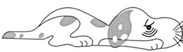
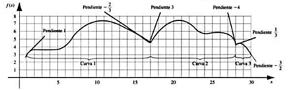

```{r setup, include=FALSE}
knitr::opts_chunk$set(echo = TRUE)
```

## Analisis Numerico 2019-1
### Por Carlos Restrepo

##En que consiste el reto:

Construir un Interpolador (no necesariamente en forma polinomica) utilizando la  menor cantidad de puntos puntos k (parte superior y/o inferior o en total) y reproducir el dibujo del contorno completo del perrito sin bigotes (mejor exactitud) con la información dada :

```{r echo=FALSE, fig.cap="A caption", out.width = '70%'}

```
```{r echo=FALSE, fig.cap="A caption", out.width = '70%'}

```
##Criterios:

1.   Metodología que explique como se seleccionaron k puntos con k<n con n el total de puntos dados(Selección de más puntos o de los puntos de la parte de abajo)
2. Algoritmo que se aplico(justificación) aplico por ejemplo,interpolación polinomica y como soluciono el sistema
3. Validación del resultado

##Productos
1. Algoritmo,requerimientos,codificación
2. Codificación, tabla donde esta la interpolación en los n-k puntos (no seleccionados), el polinomio o la función interpolante. En un plano los puntos originales, los utilizados ,el contorno  y el interpolado(utilice el grosor minimo para la curva).
    + Calcular la cota de error de su método con los datos experimentales y comparela con la cota teorica.
3. tabla donde esten los valores interpolados(tenga en cuenta los que no utilizo), los originales y el error relativo , calcule un error relativo total como la suma de los errores relativos. 
    + Cree una funcion que cuente el numero aciertos y el numero de diferencias en una cifra entre su función de interpolacion y los originales y implementelo como 
el índice de Jaccard.
4. Cree una función que muestre la eficiencia de su metodo
* Preguntas?
1. El origen se puede modoficar?
   + Se podria.
2. Si tenemos nueva información osea nodos como podemos implementar esa información en el algoritmo de interpolación?
   + Modificar he ingrisar
3. Su método es robusto, en el sentido que si se tienen más puntos la exactitud no disminuye?
   + No lo es
4. Suponga que tiene más puntos con más cifras significativas como se comporta su algoritmo ? la exactitud decae?
  + Alteraciones en la grafica
```{r cars}
require(pracma)

xi = c(1,2,5,6,7.5,8.1,10,13,17.6,20,23.5,24.5,25,26.5,27.5,28,29,30)
yi = c(3,3.7,3.9,4.5,5.7,6.69,7.12,6.7,4.45,7,6.1,5.6,5.87,5.15,4.1,4.3,4.1,3)

xd = c(1,2,5,6,7,8.1,10,13,17.6,20,23,24,25,27,27.7,28,29,30,1)
yd = c(2.0,3.7,3.9,4.2,5.7,6.6,7.1,6.7,4.5,7.0,6.1,5.6,5.8,5.2,4.1,4.3,4.1,2.0,2)

```
## Seleccion de Puntos para Interpolacion

#Gráfica de los puntos sin Interpolar
XDatos Prof| Y Datos Prof |XDatos Libro| Y Datos Libro
----------------- | ------------------- | ------------------- | -------------------
1	|3		|1	|3
2	|3.7		|2	|3.7
5	|3.9		|5	|3.9
6	|4.5		|6	|4.2
7.5|	5.7		|7	|5.7
8.1	|6.69		|8.1|	6.6
10	|7.12		|10	|7.1
13	|6.7		|13	|6.7
17.6|	4.45	|	17.6|	4.5
20	|7		|20	|7
23.5|	6.1	|	23	|6.1
24.5|	5.6	|	24	|5.6
25	|5.87	|	25	|5.8
26.5|	5.15|		27|	5.2
27.5|	4.1	|	27.7|	4.1
28	|4.3	|	28|	4.3
29	|4.1	|	29|	4.1
30	|3		|30|	3
## Medias 
Media #datos |  Media X Prof | Media Y Prof |  Media X Libro | Media Y Libro
----------------- | ------------------- | ------------------- |----------------- | -------------------
9.5|	16.9|	5.05|		16.8|5.03

## Regiones a trabajar 
Regiones a trabajar |  Puntos Cola  | Cabeza |  Nariz-Pata 
----------------- | ------------------- | ------------------- |----------------- | ------------------- 
3|	1-8 |	8-13|		13-18
## Algoritmo Usado

* Metodo de la forma baricéntrica de Lagrange:
+ Recibe el intervalo de nodos para realizar la interpolación
+ La forma de Lagrange del polinomio interpolante es atractiva para propósitos teóricos. Sin embargo se puede re-escribir en una forma que se vuelva eficiente para el cálculo computacional además de ser numéricamente mucho más estable. La forma modificada y la forma baricéntrica de Lagrange son útiles cuando queremos interpolar una función en todo un intervalo con un con un polinomio interpolante.
+ #### 1. Paquete Pracma
+ + Este paquete proporciona implementaciones en R de funciones más avanzadas en análisis numérico, con una vista especial sobre rutinas de optimización y series de tiempo.
+ #### 2. Seq
+ + La función seq () en R genera una secuencia de números.
+ + seq(from, to, by, length.out)
+ + desde,hasta, rango, tamaño de secuencia
+ #### 3. Barylag
+ + Barylag interpola los datos dados utilizando la fórmula de interpolación de Lagrange baricéntrica (vectorizada para eliminar todos los bucles).
+ + barylag(xi, yi, x)
+ + (xi) y (yi) Cordenadas para los nodos
+ + (x) Puntos de Interpolacion

## Cotas:

Cota teoricas: 

X| YProf | YLibro
---|---|--
5 |3.9|3.9
10|7.12|7.1
20|7|7
26|5.15|5.2
28|4.3|4.3
## Resultados graficos para datos profesora

You can also embed plots, for example:

```{r}
#Gráfica de los puntos
plot(xi,yi, pch=21, cex=1, col = "red", asp=1,xlab="X", ylab="Y", main="Perro Durmiendo Datos profesora")

LineaInterpolacion<-function(inicio, final){
  xi0 = xi[inicio:final]
  yi0 = yi[inicio:final]
  x0 <- seq(xi[inicio], xi[final], len=20)
  y0 <- barylag(xi0, yi0, x0)
  print(x0)
  lines(x0, y0, col="blue")
}

LineaInterpolacion (1,4)
LineaInterpolacion (4,6)
LineaInterpolacion (6,8)

LineaInterpolacion (8,9)
LineaInterpolacion (9,11)
LineaInterpolacion (11,13)


LineaInterpolacion (13,15)
LineaInterpolacion (15,16)
LineaInterpolacion (16,18)
```

## Resultados graficos para datos del libro

```{r}

#Gráfica de los puntos
plot(xd,yd, pch=21, cex=1, col = "red", asp=1,xlab="X", ylab="Y", main="Perro Durmiendo Datos Libro")

LineaInterpolacion2<-function(inicio, final){
  xi0 = xd[inicio:final]
  yi0 = yd[inicio:final]
  x0 <- seq(xd[inicio], xd[final], len=20)
  print(x0)
  y0 <- barylag(xi0, yi0, x0)
  lines(x0, y0, col="blue")
}

LineaInterpolacion2 (1,4)
LineaInterpolacion2 (4,6)
LineaInterpolacion2 (6,8)

LineaInterpolacion2 (8,9)
LineaInterpolacion2 (9,11)
LineaInterpolacion2 (11,13)

LineaInterpolacion2 (13,15)
LineaInterpolacion2 (15,16)
LineaInterpolacion2 (16,18)
LineaInterpolacion2 (18,19)
LineaInterpolacion2 (19,20)


```

##### http://disi.unal.edu.co/~lctorress/MetNum/MeNuCl03.pdf
##### https://fac.ksu.edu.sa/sites/default/files/numerical_analysis_9th.pdf
##### http://numat.net/tutor/error_interp.pdf
##### https://w3.ual.es/~aposadas/TeoriaErrores.pdf
##### http://www.sc.ehu.es/nmwmigaj/instrum.htm
##### https://tarwi.lamolina.edu.pe/~fmendiburu/index-filer/academic/script_numerico.htm

Carlos Manuel Restrepo Riveros

Note that the `echo = FALSE` parameter was added to the code chunk to prevent printing of the R code that generated the plot.
